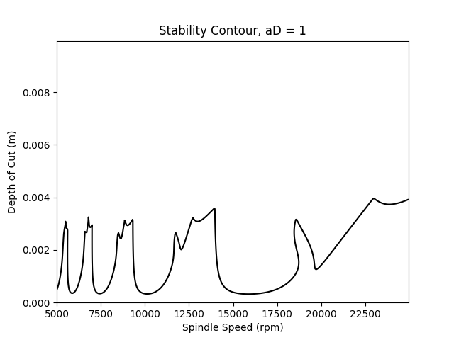
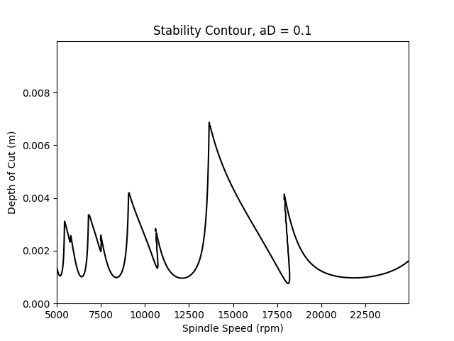
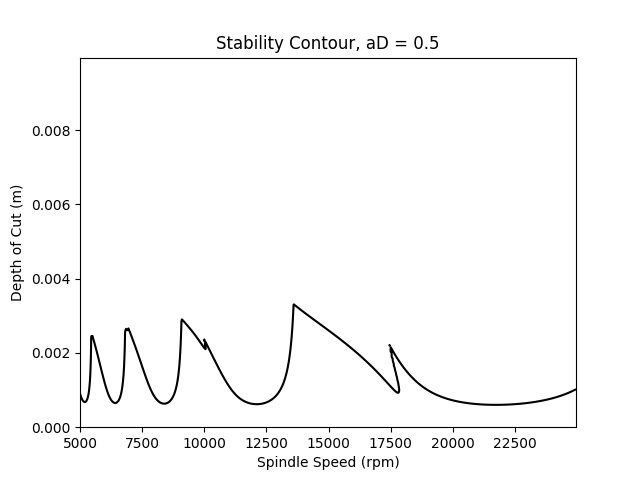
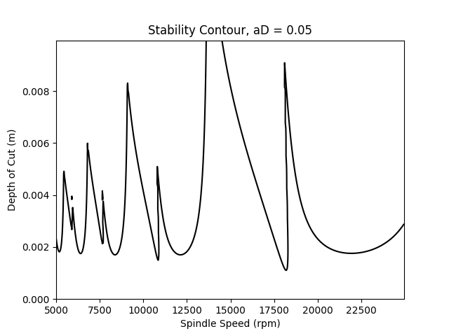

# Milling Analyzer

> Module for analyzing mill-cutting to find chatter-free modes.

## Table of Contents

1. [Description](#description)
2. [Installation](#installation)
3. [Example](#example)
4. [Dependencies](#dependencies)
5. [Support](#support)
6. [Authors](#authors)
7. [License](#license)

## Description

Milling Analyzer is a module for analyzing mill-cutting processes to identify chatter-free modes.

## Installation

To install the project and dependencies, clone the repository and use `Poetry` for installation:

```bash
# Clone the repository
git clone https://github.com/username/milling-analyzer.git
cd milling-analyzer

# Install dependencies with Poetry
poetry install
```
To activate the virtual environment and enter it, use the following command:
```bash
poetry shell
```
## Example
After installation, you can use Milling Analyzer for analysis and plotting graphs. Here’s an example:

```python
from src.mill import Mill
from src.solver import Solver
import matplotlib.pyplot as plt
# Initialize the Mill and Solver objects
mill = Mill(...)  # Initialize with the necessary parameters
solver = Solver(mill, ...)

# Perform the analysis
ss, dc, ei = solver.solve()

# Plot the contour using matplotlib
plt.figure()
plt.contour(ss, dc, ei, [1], colors='k')
plt.show()
```

#### Output plot for example code from [main.py](main.py) for different a/D ratios:





## Dependencies
This project requires the following libraries:

* matplotlib — for plotting graphs
* scipy — for numerical computations
* numpy — for working with arrays and matrices
* numba — for performance optimization
## Support
If you have any questions, you can create an Issue in the repository or contact us via email: elnikow.max@gmail.com.

## Authors
V0es — main developer and author — [GitHub](https://github.com/V0es/)
## License
This project is licensed under the MIT License. See the LICENSE file for more details.
